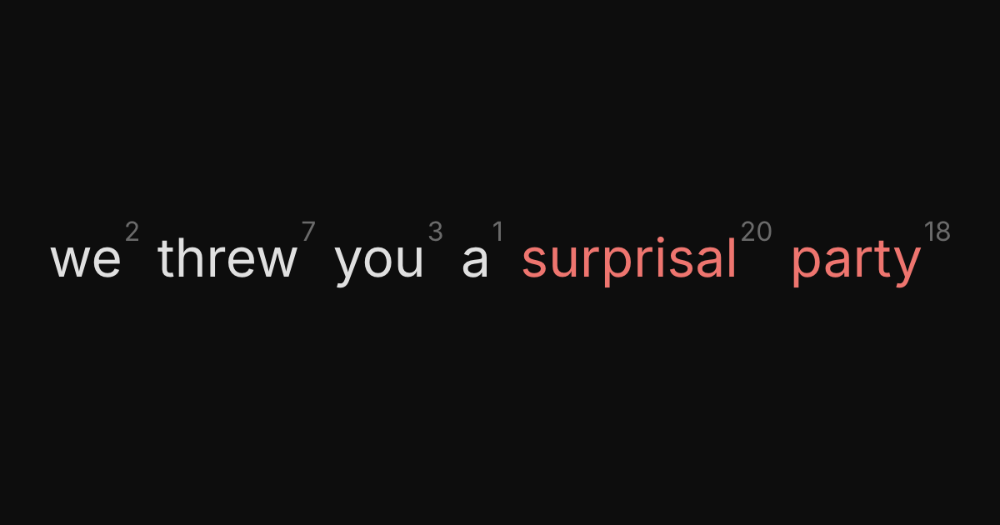
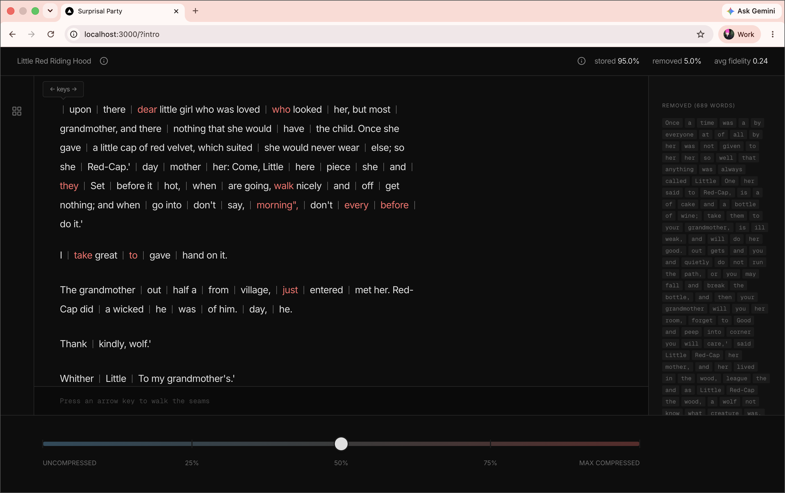

# Surprisal Party



Predictable words carry little information, surprising words carry a lot. Suprisal Party demonstrates a text compression algorithm that preserves words at varying levels of compression based on their surprisal value. Drag the slider to max compression and what stays is the irreducible kernel the model could not have known. Hidden in between the compression seams are predictions of neighboring words. The higher the compression, the more lossy the predictions become.



## Docs

- [`docs/abstract.md`](docs/abstract.md) — what the project is, the information-theoretic core, what the user sees, the determinism/variability tiers, scope, and design principles.
- [`docs/user-scenarios.md`](docs/user-scenarios.md) — Gherkin-style behavior specs.
- [`docs/implementation-plan.md`](docs/implementation-plan.md) — four-phase build plan, committed architectural decisions, and exit criteria.
- [`docs/process.md`](docs/process.md) — how the project was actually built, step by step (for a later write-up).
- [`docs/prototyping-layout.md`](docs/prototyping-layout.md) — the detailed UX/UI layout brief used to prototype with Figma Make (a frozen prototyping-phase artifact).
- [`docs/figma-sources.yaml`](docs/figma-sources.yaml) — the scenario ↔ Figma Design frame map (traceability in both directions).
- [`docs/figma-make-realignment-prompts.md`](docs/figma-make-realignment-prompts.md) — versioned Figma Make prompts for realigning the prototype/Design frames to the shipped runtime.
- [`runtime/README.md`](runtime/README.md) — running and developing the Next.js runtime: setup, scripts, project structure, and how it consumes the pipeline's JSON.
- [`runtime/CLAUDE.md`](runtime/CLAUDE.md) — the runtime's architectural commitments (static export, the authoritative cache schema, determinism).

## Layout

```text
surprisal-party/
├── docs/                      # design docs
├── pipeline/                  # Python — offline build pipeline (Phase 0 & 1)
└── runtime/                   # Next.js — slider runtime (Phase 2 & 3)
    └── public/
        └── tales/             # static JSON output, one per tale (committed)
```

## Stack

- **Pipeline:** Python. Loads `Qwen/Qwen2.5-7B-Instruct` locally via `transformers` for both surprisal scoring (single forward pass) and gap reconstruction; writes one JSON per tale into `runtime/public/tales/`. No API keys.
- **Runtime:** Next.js, deployed to Vercel. Serves tale JSONs as static assets and renders the slider mechanic in the browser.
